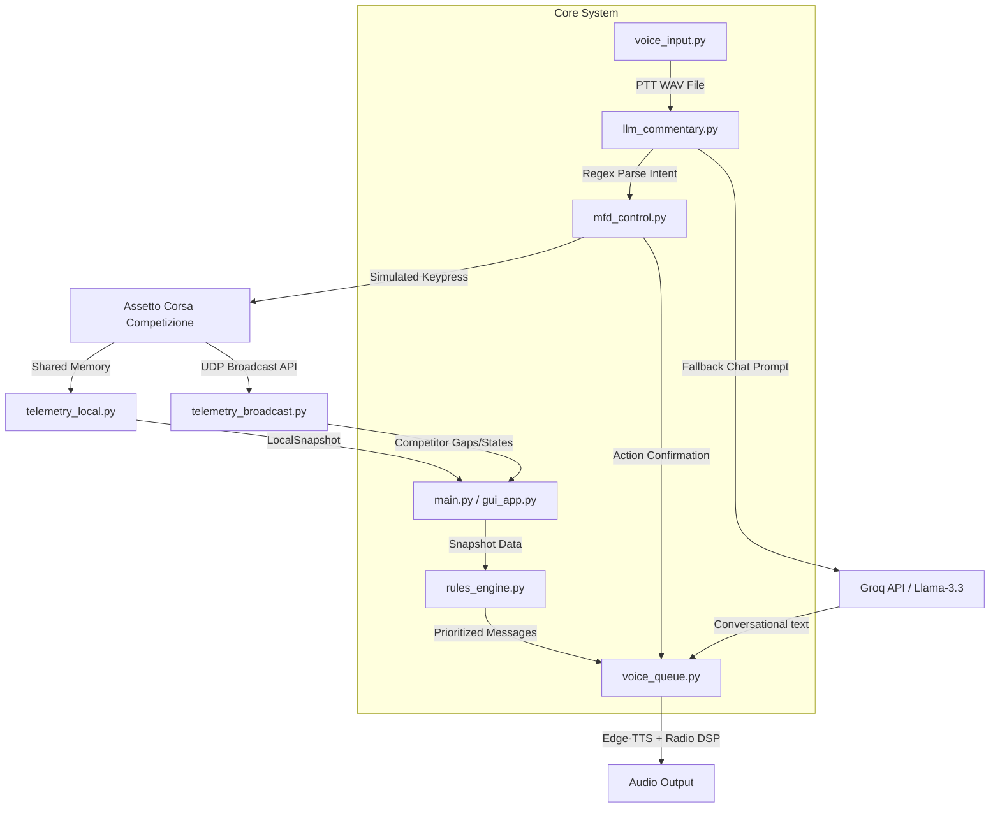

# Technical Walkthrough: Race Engineer Bawel for ACC

Welcome to the technical documentation of the **Race Engineer Bawel for Assetto Corsa Competizione (ACC)**. This guide provides a comprehensive architectural walkthrough, component details, data-flow diagrams, and implementation specifics of the system.

---

## 1. System Architecture

The project is structured as a real-time, multi-threaded telemetry monitoring and voice-interactive assistant system. It reads local shared memory, queries ACC’s UDP broadcasting API, processes rules, captures user voice commands, simulates keyboard inputs (MFD adjustments), and reads out engineer feedback with a realistic radio filter.

Here is the high-level system layout:

---

## 2. Core Components

### 🏎️ Telemetry Processing

#### Local Telemetry Reader (`telemetry_local.py`)
*   **Mechanism**: Directly maps to ACC's named shared memory (`Local\\acUpdPhysics`, `Local\\acUpdGraphics`, `Local\\acUpdStatic`).
*   **Attributes**: Fetches instantaneous physics data (speed, gears, RPM, tire temperatures, brake temperatures, fuel level, lap timing, and setup settings).
*   **Advantage**: Very fast, sub-millisecond reads, works without complex configurations as soon as ACC is active.

#### Broadcast Telemetry Reader (`telemetry_broadcast.py`)
*   **Mechanism**: Hooks into ACC’s network-based UDP Broadcasting protocol using `accapi`.
*   **Attributes**: Discovers full session metadata, entry list of all drivers, real-time tracking of track positions, gaps to cars ahead and behind, and competitor lap times.
*   **Configuration**: Matches your `broadcasting.json` connection credentials.

---

### 🧠 Logic & Rule Assessment (`rules_engine.py`)

The **Rules Engine** acts as the deterministic "brain" of the engineer. It evaluates telemetry snapshots and queues messages based on specific triggers:

*   **Pre-Race & Formation Gating**: While waiting on the grid or in a formation lap (`_race_started = False`), it suppresses race-specific audio notifications (like gaps or lap times) while keeping state synced silently. This prevents a burst of outdated audio when the green flag waves.
*   **Driver Swap & Name Tracking**: Monitors driver changes during pitstops. If `player_surname` changes relative to the initial driver:
    1.  Welcomes the new driver (`"Welcome, [Name]! Tyres are cold..."`).
    2.  Updates its internal active driver registry so all future name-injection overlays (e.g., *"Box this lap, [Name]"*) reflect the new driver.
*   **Session Time Callouts**: Warns when the remaining session time drops past 30, 15, 10, 5, or 1 minute.
*   **Gap Trend Analysis**: Evaluates a rolling window of distance gaps to the car ahead. If you are catching or losing ground consistently over several laps, it gives a stint-trend update.
*   **Lap Consistency Recognition**: Keeps track of recent lap times and praises the driver when 3 consecutive valid laps are within a $\pm$0.3s spread.
*   **Gap to Leader Reporting**: Triggers a notification every 5 completed laps highlighting your position and gap to the cars ahead.
*   **Out-Lap Tracking**: Monitors pitlane exit events and coaches you to build tire temperature gradually, providing feedback at the end of the out-lap.

---

### 🎙️ Voice Interaction & Commands

#### Push-to-Talk Listener (`voice_input.py`)
*   **Mechanism**: Monitors keyboard hooks via `pynput` for the key mapped in `config.py` (default: `Caps Lock`).
*   **Recording**: Captures mono audio at 16kHz via `sounddevice` into temporary `.wav` files when the PTT key is held down.

#### LLM Banter & Commands Coordinator (`llm_commentary.py`)
*   **Speech-to-Text**: Converts `.wav` recordings to text using the Groq Whisper-large-v3 model.
*   **Banter Thread**: Periodically feeds the current telemetry snapshot into Groq's Llama model to generate contextual banter (strategic tips, warnings about tires, or driver motivation).

#### MFD Simulator (`mfd_control.py`)
Before sending voice text to the LLM, the system intercepts commands using regex patterns. If a command match is found, it directs actions to the **MFD Controller** instead of invoking the LLM:

| Pattern (Case Insensitive) | Action | Keypress Emulation (ACC Window) |
|---|---|---|
| `"set fuel to X"` / `"fuel X"` | Sets absolute pit fuel target | Page Down to Pit Strategy $\rightarrow$ Down Arrow to fuel $\rightarrow$ Left Arrows to 0 $\rightarrow$ Right Arrows to X |
| `"add X liters"` / `"add X"` | Adds fuel increment | Page Down $\rightarrow$ Down Arrow to fuel $\rightarrow$ Right Arrows to increment |
| `"engine map X"` / `"map X"` | Adjusts engine map setting | Right/Left arrow inputs based on telemetry delta |
| `"brake bias X"` / `"bias X"` | Modifies brake bias | Right/Left arrow inputs based on telemetry delta |
| `"switch to wet"` / `"dry tyres"` | Toggles pit tire compound | Page Down $\rightarrow$ Down Arrow to tyres $\rightarrow$ Right/Left Arrow to toggle |

---

### 📻 Text-To-Speech Queue (`voice_queue.py`)

Manages queued alerts to prevent audio overlapping, filter out stale notifications, and apply an authentic GT3 radio effect:

1.  **Priority Queue**:
    *   `Priority 0 (Urgent)`: Critical fuel warnings, yellow flags.
    *   `Priority 1 (Normal)`: Minor gaps, tire warnings, pit window alerts.
    *   `Priority 2 (Banter)`: LLM chatter, idle comments. (Banter is automatically discarded if the queue backs up with racing alerts).
2.  **Latency Gate**: Drops non-urgent messages older than 7 seconds to prevent old notifications from stacking up.
3.  **Radio Signal DSP Pipeline**:
    *   *Bandpass filter (300 Hz - 3400 Hz)*: Simulates thin, telephone/radio audio characteristics.
    *   *Tanh Saturation*: Applies warm analogue-style harmonic clipping distortion.
    *   *Static Noise overlay*: Adds a subtle, constant background static hum.
    *   *Mic Clicks*: Prepends and appends authentic walkie-talkie beeps and mic engagement clicks.

---

## 3. Workflow Diagnostics

If settings are not executing in-game, verify the following configuration points:

1.  **Window Focus**: The keypress emulator sends `PostMessage` directly to the window with title/class `AC2` or `Assetto Corsa Competizione`. Make sure ACC is running and in focus.
2.  **Key Bindings**: By default, `mfd_control.py` maps to standard Page Up/Down and Arrow keys. Ensure you have not custom-mapped these keys in your ACC control settings.
3.  **Broadcasting API**: Ensure the script can write and bind to port `9000` with the matching password (`asd`) specified in:
    `Documents\Assetto Corsa Competizione\Config\broadcasting.json`.

---

*Thank you for racing with Race Engineer Bawel! Keep it on the black stuff.*
